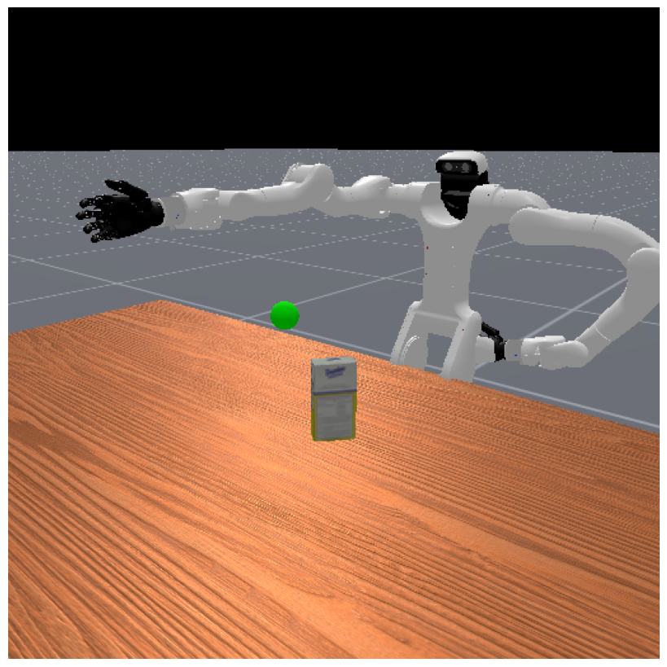

# Vega Grasp

This is a reinforcement learning project for the Vega robot to grasp and place objects from the YCB dataset.



## Installation

```bash
git clone --recurse-submodules git@github.com:sszxc/ManiSkill.git
conda env create -f environment.yml
conda activate vegagrasp
pip install -e .
```

Note: Comment out all <mimic joint="..."> tags in vega_grasp/dexmate-urdf/robots/humanoid/vega_1/vega_upper_body.urdf, otherwise it will cause conflicts with Sapien.

## Usage

```bash
python ppo.py
python ppo_rgb.py
```

## Code Structure

- `vega_robot.py`: code for Vega robot
- `pick_single_ycb.py`: code for desktop grasp task
- `ppo.py`: code for PPO algorithm
- `ppo_rgb.py`: code for PPO algorithm with RGB-D image observations

## Technical approach explanation

- Use URDF to import the robot, and use PD controller to implement joint position control (some fingers use mimic controller to implement underactuated tracking)
- Use ManiSkill environment to build the desktop grasp task, randomize the object type, object position, target position, table height, etc.
- Use PPO algorithm to train, use state or state + rgbd as input
- The reward function includes approaching reward, grasping reward, stable reward, relative velocity penalty, object falling penalty, arm collision penalty, etc.
